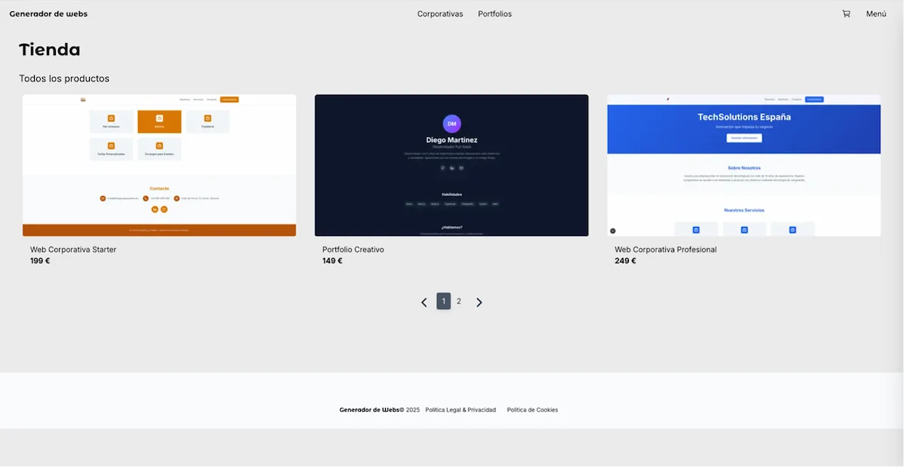
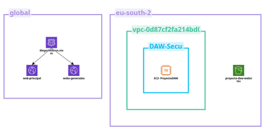

# Proyecto final DAW - Diego Chillerón

## Descripción

Sistema de e-commerce de venta de plantillas web personalizables. Los usuarios pueden adquirir plantillas de diferentes tipos (corporativas o portfolios) y personalizarlas mediante un formulario con los datos corporativos o personales. El sistema genera automáticamente el sitio web. Realiza la compilación de la pantilla como web estatica en Next.js con los datos proporcionados, lo despliega en AWS S3 mediante el SDK-S3 y Cloudfront lo sirve como un subdominio del dominio principal mediante Cloudfront Functions.

## Stack Tecnológico

### Frontend
- **Next.js 16** - Framework React con SSR/SSG
- **React 19** - Librería de UI
- **TypeScript** - Tipado estático
- **Tailwind CSS 4** - Estilos utility-first
- **Zustand** - Gestión de estado
- **React Hook Form** - Manejo de formularios
- **Swiper** - Carruseles y sliders

### Backend
- **Next.js API Routes** - Endpoints serverless
- **Prisma 7** - ORM para PostgreSQL
- **Better Auth** - Autenticación
- **PayPal SDK** - Procesamiento de pagos

### Infraestructura
- **PostgreSQL** - Base de datos
- **AWS S3** - Almacenamiento y hosting estático
- **AWS CloudFront** - CDN
- **AWS EC2** - Servidor de producción
- **Docker** - Contenedores para desarrollo
- **PM2** - Gestión de procesos en producción

## Despliegue

El proyecto está configurado para desplegarse en AWS:

- **Aplicación principal**: EC2 con PM2
- **Sitios generados**: S3 + CloudFront (CloudFront Fuctions redirigiendo subdirectorios como subdominios).
- **Base de datos**: PostgreSQL (RDS o instancia propia)

El script `ec2-datos-de-usuario.sh` contiene la configuración de User Data para instancias EC2 (Configurar variables de entorno).
